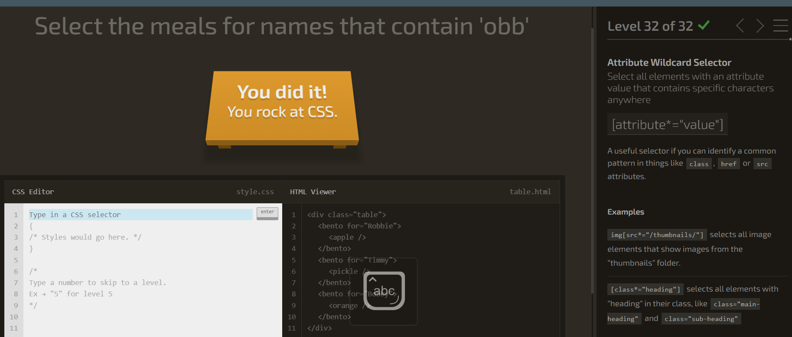
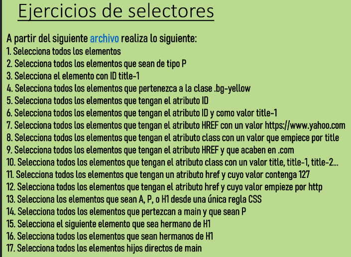
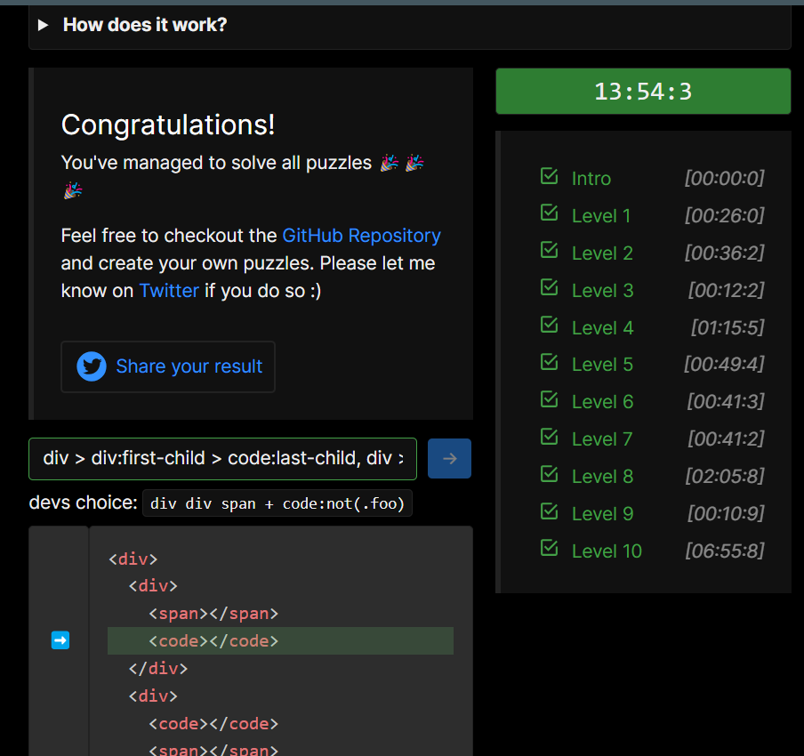

# CSS
## Actividades

1.

[Enlace](index1.html)

2.

3.

Level 1: p{}
Level 2: #me{}
Level 3: .lol{}
Level 4: .lol.wut{}
Lveel 5: p.meh{}
Level 6: p, #bop{}

4.

[Enlace](index2.html)

1. *{}
2. p
3. #title-1
4. .bg-yellow
5. [ID]
6. [ID="title-1"]
7. [href="https://www.yahoo.com"]
8. [class^="title"]
9. [href$=".com"]
10. [class="title"], [class="title-1"], [class="title-2"]
11. [href*="127"]
12. [href^="http"]
13. a, p, h1
14. main p
15. h1 + *
16. h1 ~ *
17. main > *

5.

1. ul > li:first-child
   
2. p:nth-child(1), p:nth-child(3), p:nth-child(4)
   
3. li:nth-child(3), li:nth-child(5), li:nth-child(7)
4. span:first-child, p
   
5. div:first-child > span:first-child, span[data-item=bar]
6. span:nth-child(5), span:nth-child(6), span:nth-child(9)
   
7. input:first-child, input:nth-child(3),  input:nth-child(4), button:last-child
   
8. li:nth-child(1), li:nth-child(2), li:nth-child(5), li:nth-child(6), li:nth-child(9)
   
9.  p:nth-child(2) > span, p:nth-child(3) > span:nth-child(3), div > span:last-child
    
10. #foo > .foo
    
11. div > div:first-child > code:last-child, div > div:nth-child(2) > code:last-child

