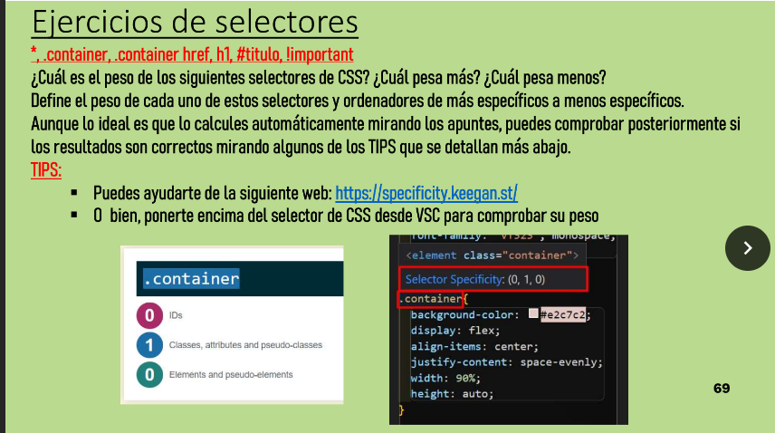

# CSS
## Actividades

## Actividad 1

[Enlace](index1.html)

## Actividad 2

## Actividad 3

Level 1: p{}

Level 2: #me{}

Level 3: .lol{}

Level 4: .lol.wut{}

Lveel 5: p.meh{}

Level 6: p, #bop{}

## Actividad 4

[Enlace](index2.html)

1. *{}
2. p
3. #title-1
4. .bg-yellow
5. [ID]
6. [ID="title-1"]
7. [href="https://www.yahoo.com"]
8. [class^="title"]
9. [href$=".com"]
10. [class="title"], [class="title-1"], [class="title-2"]
11. [href*="127"]
12. [href^="http"]
13. a, p, h1
14. main p
15. h1 + *
16. h1 ~ *
17. main > *

## Actividad 5 

1. ul > li:first-child
   
2. p:nth-child(1), p:nth-child(3), p:nth-child(4)
   
3. li:nth-child(3), li:nth-child(5), li:nth-child(7)
4. span:first-child, p
   
5. div:first-child > span:first-child, span[data-item=bar]
6. span:nth-child(5), span:nth-child(6), span:nth-child(9)
   
7. input:first-child, input:nth-child(3),  input:nth-child(4), button:last-child
   
8. li:nth-child(1), li:nth-child(2), li:nth-child(5), li:nth-child(6), li:nth-child(9)
   
9.  p:nth-child(2) > span, p:nth-child(3) > span:nth-child(3), div > span:last-child
    
10. #foo > .foo
    
11. div > div:first-child > code:last-child, div > div:nth-child(2) > code:last-child

## Ejercicios de selectores

# Ejercicios de selectores

## Selectores
``*``, ``.container``, ``.container href``, ``h1``, ``#titulo``, ``!important``

¿Cuál es el peso de los siguientes selectores de CSS? ¿Cuál pesa más? ¿Cuál pesa menos?

Define el peso de cada uno de estos selectores y ordénalos de más específicos a menos específicos.

Aunque lo ideal es que lo calcules automáticamente mirando los apuntes, puedes comprobar posteriormente si los resultados son correctos mirando algunos de los TIPS que se detallan más abajo.

## TIPS
- Puedes ayudarte de la siguiente web: [https://specificity.keegan.st/](https://specificity.keegan.st/)
- O bien, ponte encima del selector de CSS desde VSC para comprobar su peso

## Teoría de especificidad

- Los selectores de ID tienen un valor de especificidad de **100**.
- Los selectores de clases, atributos y pseudo-clases tienen un valor de especificidad de **10**.
- Los selectores de elementos y pseudo-elementos tienen un valor de especificidad de **1**.
- Los selectores universales y combinadores no suman especificidad por sí solos.

### Análisis de los selectores dados

1. ``*`` (universal): especificidad (0, 0, 0, 0)
2. ``.container`` (clase): especificidad (0, 0, 1, 0)
3. ``.container href`` (clase + elemento): especificidad (0, 0, 1, 1)
4. ``h1`` (elemento): especificidad (0, 0, 0, 1)
5. ``#titulo`` (ID): especificidad (0, 1, 0, 0)
6. ``!important`` (no afecta la especificidad pero sobrescribe reglas): especificidad (0, 0, 0, 0)

### Orden de especificidad

1. ``#titulo`` (ID): especificidad (0, 1, 0, 0)
2. ``.container href`` (clase + elemento): especificidad (0, 0, 1, 1)
3. ``.container`` (clase): especificidad (0, 0, 1, 0)
4. ``h1`` (elemento): especificidad (0, 0, 0, 1)
5. ``*`` (universal): especificidad (0, 0, 0, 0)
6. ``!important`` (sobrescribe reglas pero no suma especificidad): especificidad (0, 0, 0, 0)
